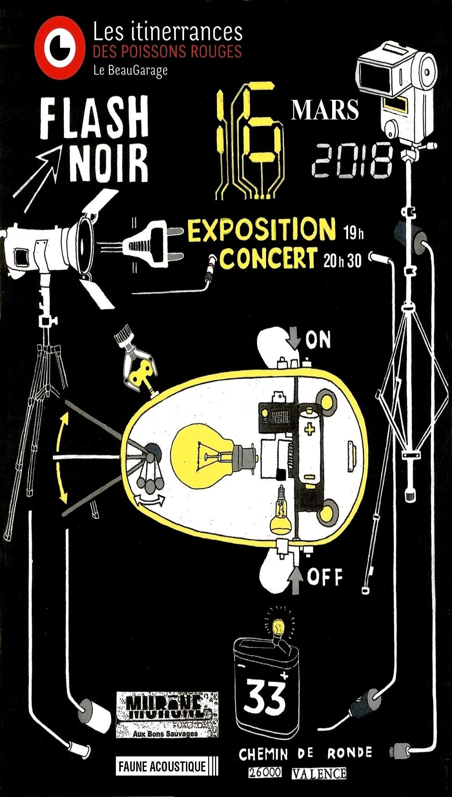

33 chemin de ronde, 26000 Valence.

<h3>Exposition - 19h</h3>

  19h vernissage avec une performance de D.D.D (pochoiriste) et 9 artistes exposants dans le noir !

<h3>Concert - 20h30</h3>

  Concert de MURèNE et FAUNE ACOUSTIQUE

  

