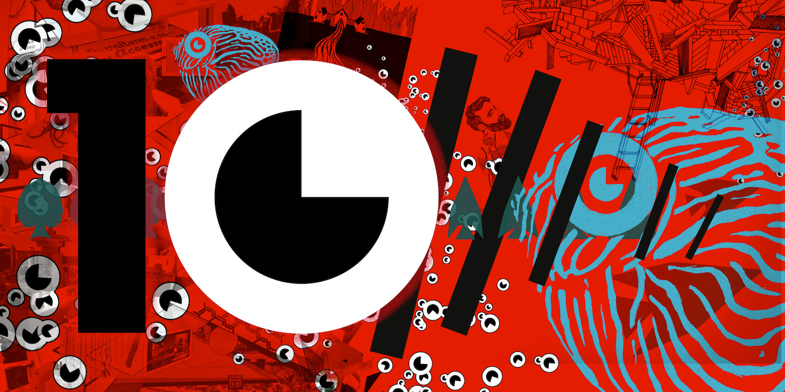

<h3>
  10ème festival itinerrance des poissons rouges du <strong>5 au 10 juin 2019</strong>
</h3>

  Cela fait dix ans que le Festival « Les Itinerrances des Poissons Rouges » est un
  véritable rendez-vous des cultures contemporaines et favorise la création et la
  diffusion gratuite d'artistes à Valence.

  

<h4>
  10 / Dis - préfixe indiquant la séparation ou la dispersion
</h4>

  Les Itinerrances vous invitent cette année à vous laisser emporter par le
  mouvement entropique universel à travers des œuvres totalement 10ruptives,
  <strong>10</strong>ssociées, <strong>10</strong>ssonantes, <strong>10</strong>continues, <strong>10</strong>convenantes, <strong>10</strong>gracieuses, <strong>10</strong>proportionnées, <strong>10</strong>semblables, <strong>10</strong>symétriques, <strong>10</strong>fonctionnelles et/ou <strong>10</strong>tractives &hellip;

<h4>
  Installations / concerts / performances 
  Petite restauration et bar en extérieur ombragé
</h4>

  Venez <strong>10</strong>cuter des œuvres et <strong>10</strong>courir sur l'art autour d'un verre et d'une dégustation maison !

  L'itinerrance se poursuit cette année dans l'ancienne halte-garderie « Belle Image ». 18 rue du Jeu de Paume à Valence.

<h4>Horaires</h4>
<ul>
  <li>Mercredi 5, jeudi 6, vendredi 7 : 14h10 - 22h10.</li>
  <li>Samedi 8, dimanche 9 : 10h10 - 22h10.</li>
  <li>Lundi 10 : 14h10 - 18h10.</li>
</ul>

  Accès gratuit - Tout public.

