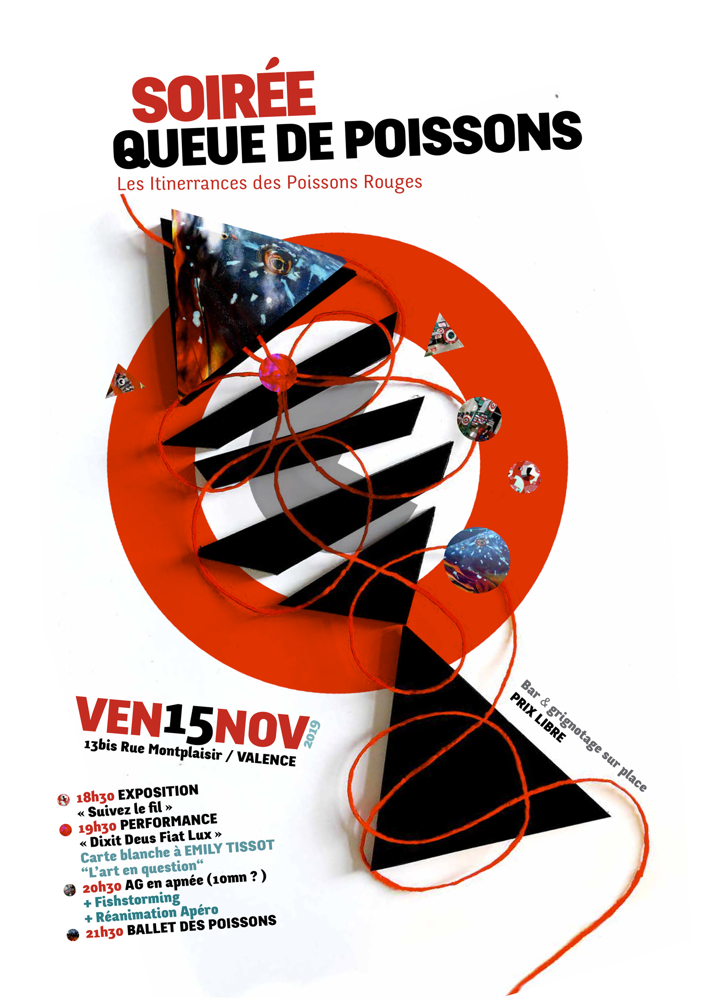

13bis rue Montplaisir, 26000 Valence

<h3>Au programme</h3>
<ul>
  <li><strong>18h30</strong> : Exposition «&nbsp;Suivez le fil&nbsp;»</li>
  <li>
    <strong>19h30</strong> : Performance «&nbsp;Dixit Deus Fiat Lux&nbsp;».
    Carte blanche à Émilie Tissot «&nbsp;L'art en question&nbsp;»
  </li>
  <li>
    <strong>20h30</strong> : AG en apnée (10 mn ?)
     + Fishstorming
     + Réanimation Apéro
  </li>
  <li><strong>21h30</strong> : Ballet des poissons</li>
</ul>

  <em>Bar & Grignotage sur place - Prix libre</em>

<h3>L'affiche</h3>

  

