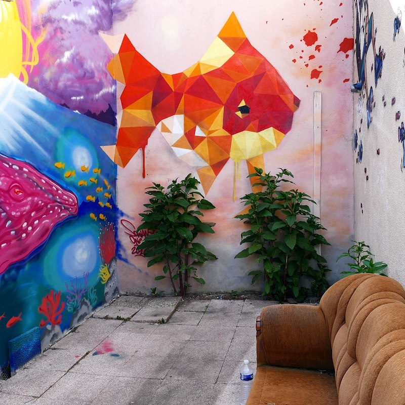
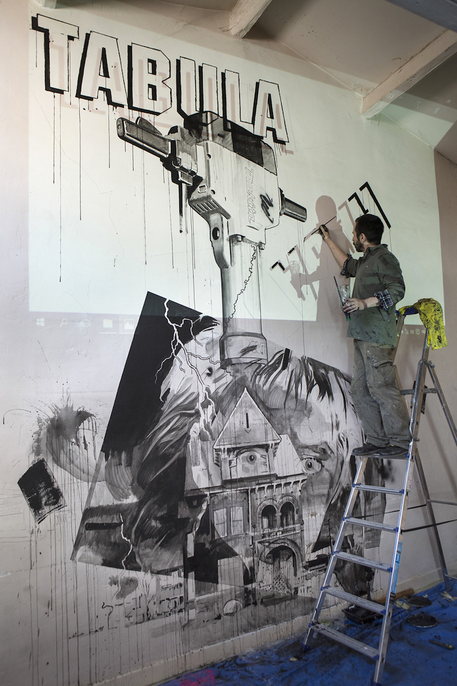
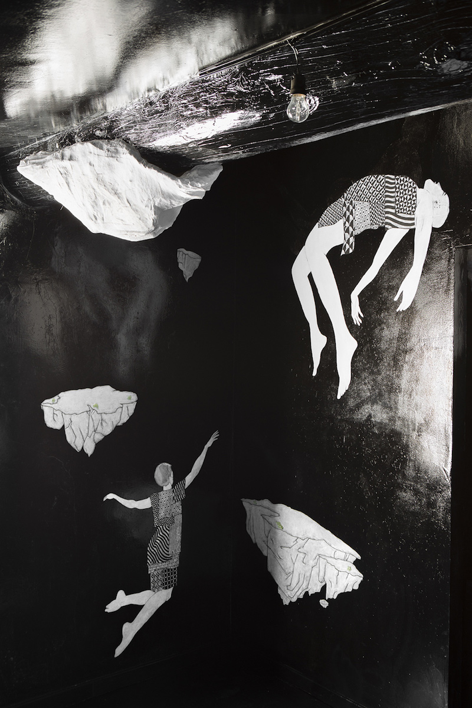

  

    

      <h2>L'association</h2>
      

        L'association « Les Itinerrances » a été créée en décembre 2010 pour l'organisation de l'événement « Les itinerrances des poissons rouges ». Elle a pour but de promouvoir l'accès à l'art contemporain et plus globalement aux arts vivants sur Valence et ses alentours, par l'aide à la création et la diffusion d'artistes et par l'accès gratuit aux lieux d'expositions en présence de médiateurs culturels.
      

      

        Le fonctionnement même de l'association et l'hétérogénéité de ses membres permettent une liberté de ton et de choix susceptibles de toucher un large public, tout en mettant l'accent sur la qualité des œuvres présentées. « Les Itinerrances des poissons rouges » ne sont pas seulement une exposition d'art contemporain mais un véritable rendez-vous de cultures contemporaines.
      

    

    

      <h2>Nous contacter</h2>
      <h3>Adresse postale</h3>
      

        Association LES ITINERRANCES 
        chez Georges Braconnay 
        33 rue Paul Bert 
        26000 VALENCE.
      

      <h3>Email</h3>
      

        &#108;&#101;&#115;&#105;&#116;&#105;&#110;&#101;&#114;&#114;&#097;&#110;&#099;&#101;&#115;&#064;&#103;&#109;&#097;&#105;&#108;&#046;&#099;&#111;&#109;
      

    

  

  

  

  

  

  

  

  

  

  

  

